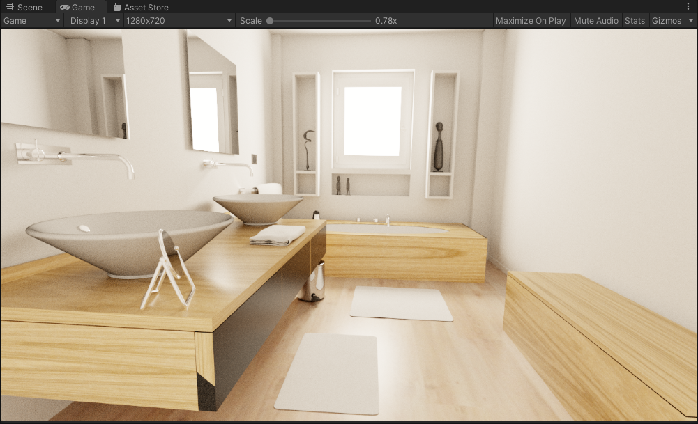
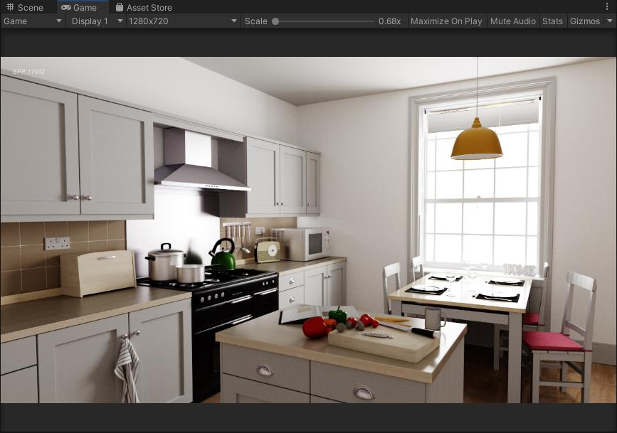
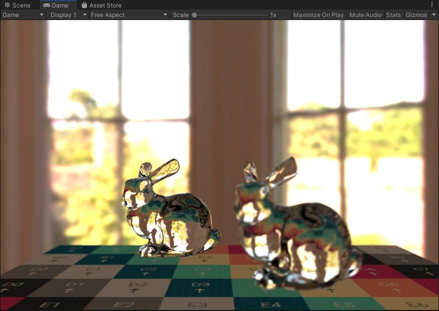

# unity-raytracing
GPU Raytracing renderer which runs in both hlsl compute shader and DXR raytracing shader in unity.
This project is implemented by hlsl vertex shader, fragment shader, compute shader and raytracing shader in Unity.
## Features
- Megakernel path tracing
- Wavefront path tracing
- DXR path tracing
- Multiple importance sampling
- Physical Base Materials
- Split BVH acceleration structure by radeonray
- Woop ray/triangle intersection
- Raycone mipmapping
- Filter importance sampling
- HDRI Environment Maps
- Depth of field

## Scene Assets
We can convert the tungsten json format to our own format which is also using json. Use the python tool(unity-raytracing/Assets/RayTracing/Editor/convert_tungsten.py) for converting the tungsten scene. You can download the tungsten scenes at https://benedikt-bitterli.me/resources/ . 
  
## ScreenShops
### cornell box

### staircase2

### bathroom2
20000 spp, Filmic tonemapping

### kitchen
15000 spp, ACE tonemapping

### depth of field and glass material

## References
- pbrt-v3 (https://github.com/mmp/pbrt-v3.git)
- pbrt-v4 (https://github.com/mmp/pbrt-v4.git)
- pbr-book (https://www.pbr-book.org/)
- LumiRenderer (https://github.com/FaithZL/LumiRender)
- Ray Tracing Gems High-Quality and Real-Time Rendering with DXR and Other APIs
- Real-time Shading with Filtered Importance Sampling
- GLSL-Pathtracer (https://github.com/knightcrawler25/GLSL-PathTracer)
- Megakernels Considered Harmful: Wavefront Path Tracing on GPUs
- Texture Level-of-Detail Strategies for Real-Time Ray Tracing
- Realtime Ray Tracing of Dynamic Scenes on an FPGA Chip
- GPU-path-tracing-tutorial-4 (https://github.com/straaljager/GPU-path-tracing-with-CUDA-tutorial-4)