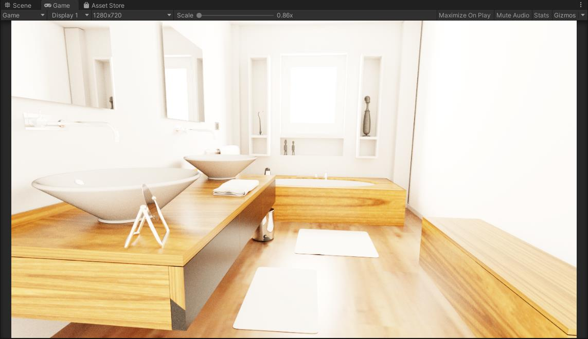

# unity-raytracing
GPU Raytracing renderer by compute shader in unity
## Features
- Megakernel path tracing
- Wavefront path tracing
- Multiple importance sampling
- Physical Base Materials
- Split BVH acceleration structure by radeonray
- Woop ray/triangle intersection
- Raycone mipmapping
- Filter importance sampling
- HDRI Environment Maps
- Depth of field
  
## ScreenShops
### cornel box

### staircase2

### bathroom2
10000 spp, ACE tonemapping

## References
- pbrt-v3 (https://github.com/mmp/pbrt-v3.git)
- pbrt-v4 (https://github.com/mmp/pbrt-v4.git)
- pbr-book (https://www.pbr-book.org/)
- LumiRenderer (https://github.com/FaithZL/LumiRender)
- Ray Tracing Gems High-Quality and Real-Time Rendering with DXR and Other APIs
- Real-time Shading with Filtered Importance Sampling
- GLSL-Pathtracer (https://github.com/knightcrawler25/GLSL-PathTracer)